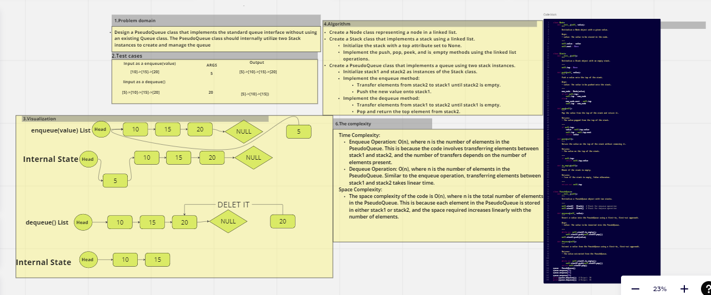

#  Queue using two Stacks
## Design a PseudoQueue class that implements the standard queue interface without using an existing Queue class. The PseudoQueue class should internally utilize two Stack instances to create and manage the queue

## Whiteboard Process
  

## Approach & Efficiency
Time Complexity:
Enqueue Operation: O(n), where n is the number of elements in the PseudoQueue. This is because the code involves transferring elements between stack1 and stack2, and the number of transfers depends on the number of elements present.
Dequeue Operation: O(n), where n is the number of elements in the PseudoQueue. Similar to the enqueue operation, transferring elements between stack1 and stack2 takes linear time.
Space Complexity:
The space complexity of the code is O(n), where n is the total number of elements in the PseudoQueue. This is because each element in the PseudoQueue is stored in either stack1 or stack2, and the space required increases linearly with the number of elements.
## Solution
 ## python code.py