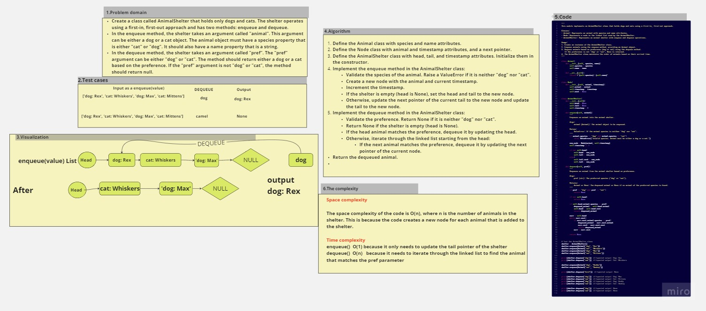

# stack-queue-animal-shelter
## Create a class called AnimalShelter that holds only dogs and cats. The shelter operates using a first-in, first-out approach and has two methods: enqueue and dequeue.

## In the enqueue method, the shelter takes an argument called "animal". This argument can be either a dog or a cat object. The animal object must have a species property that is either "cat" or "dog". It should also have a name property that is a string.

## In the dequeue method, the shelter takes an argument called "pref". The "pref" argument can be either "dog" or "cat". The method should return either a dog or a cat based on the preference. If the "pref" argument is not "dog" or "cat", the method should return null.
## Whiteboard Process

## Approach & Efficiency
 ### Enqueue Operation:

Space complexity

The space complexity of the code is O(n), where n is the number of animals in the shelter. This is because the code creates a new node for each animal that is added to the shelter.

Time complexity
enqueue()  O(1) because it only needs to update the tail pointer of the shelter
dequeue()  O(n)   because it needs to iterate through the linked list to find the animal that matches the pref parameter

## Solution
 python stack_queue.py