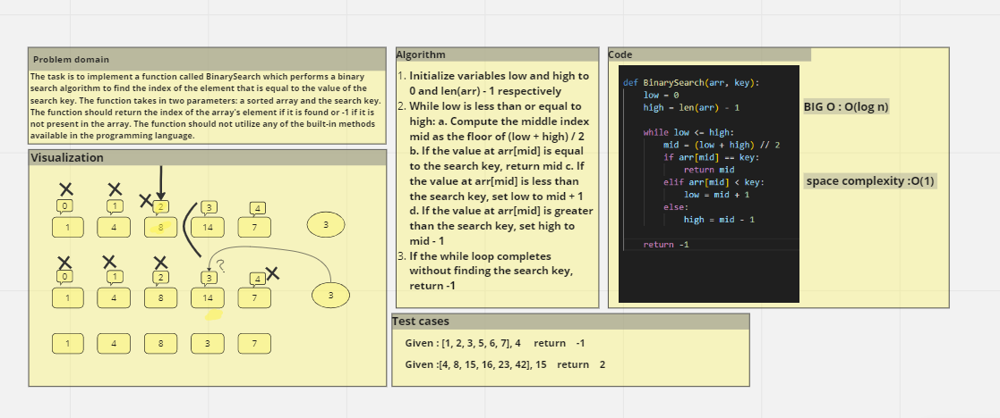

# Navigator : Malik Alhudrub 
# Driver : Sakher shteyat

# array-binary-search
## Parameters:

### sortedArray (array): A sorted array of elements
 ### searchKey (any): The element to search for in the array
 ## Returns:

###  The index of the array's element that is equal to the value of the search key if found.
###  -1 if the element is not in the array.
## Description:
###  This function performs a binary search algorithm to find the index of the element that is equal to the value of the search key. It takes in a sorted array and the search key as parameters and returns the index of the element if it is found, or -1 if it is not present in the array. The function does not utilize any of the built-in methods available in the programming language.

## Whiteboard Process

## Approach & Efficiency

### Binary  Search Algorithm
### BIG O : O(log n)
### Space complexity : O(1) 

## Solution
### python BinarySearch.py