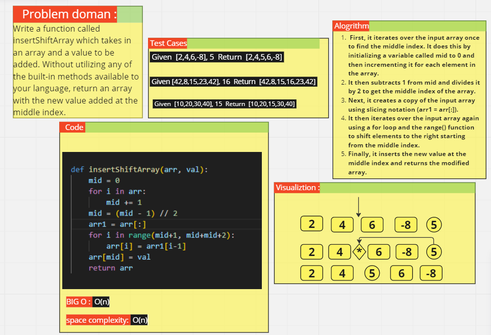

# array-insert-shift

  ## Write a function called insert Shift Array which takes in an array and a value to be added. Without utilizing any of the built-in methods available to your language and return an array with the new value added at the middle index. 

## Whiteboard Process


## Approach & Efficiency
### The Big O for my function is : O(n)

The space complexity is : O(n)

## Solution

```
 python insertShiftArray
```

