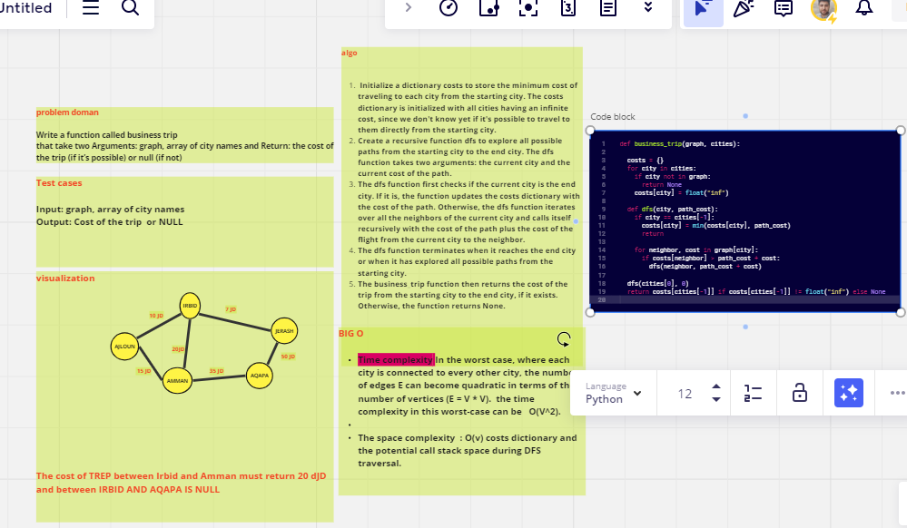

# graph-business-trip
Write a function called business trip that take two Arguments: graph, array of city names and Return: the cost of the trip (if it’s possible) or null (if not)
## Whiteboard Process
   

## Approach & Efficiency
Time complexity In the worst case, where each city is connected to every other city, the number of edges E can become quadratic in terms of the number of vertices (E = V * V).  the time complexity in this worst-case can be   O(V^2).

The space complexity  : O(v) costs dictionary and the potential call stack space during DFS traversal.

## Solution
pytest