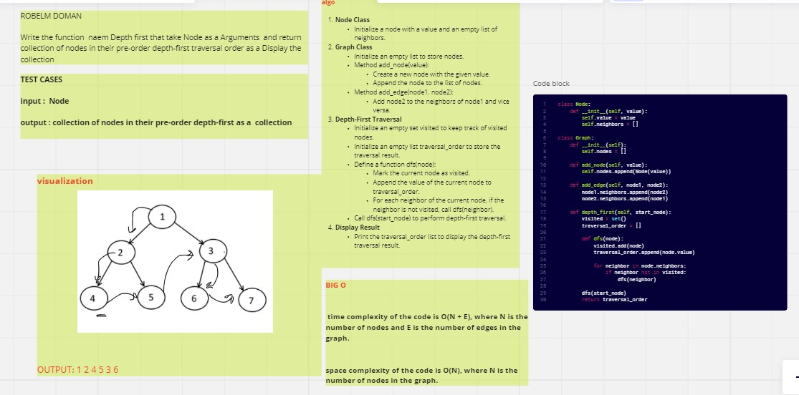

# graph-depth-first
Write the function  naem Depth first that take Node as a Arguments  and return collection of nodes in their pre-order depth-first traversal order as a Display the collection

## Whiteboard Process

## Approach & Efficiency
time complexity of the code is O(N + E), where N is the number of nodes and E is the number of edges in the graph.

space complexity of the code is O(N), where N is the number of nodes in the graph.
## Solution
pytest 
python depth_first