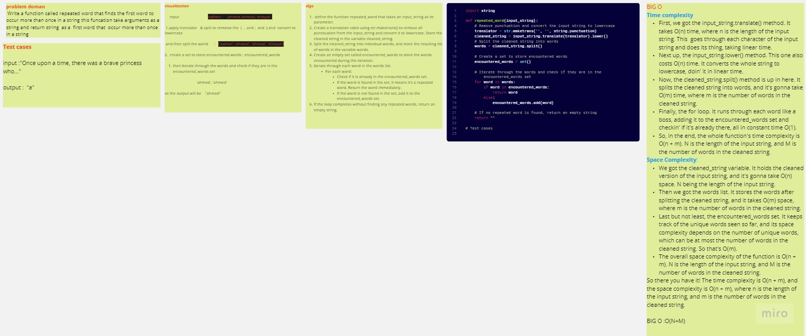

# HASH MAP
 Write a function called repeated word that finds the first word to occur more than once in a string this funcation take arguments as a string and return string  as a  first word that  occur more than once in a string
## Whiteboard Process
   

## Approach & Efficiency

  1. Time complexity : is O(n + m)
  2. Space complexity is O(n + m), where n is the length of the input string, and m is the number of words in the cleaned string.
  3. BIG O : O(n + m)
## Solution
  python hashmap.py

  and for test : pytest 