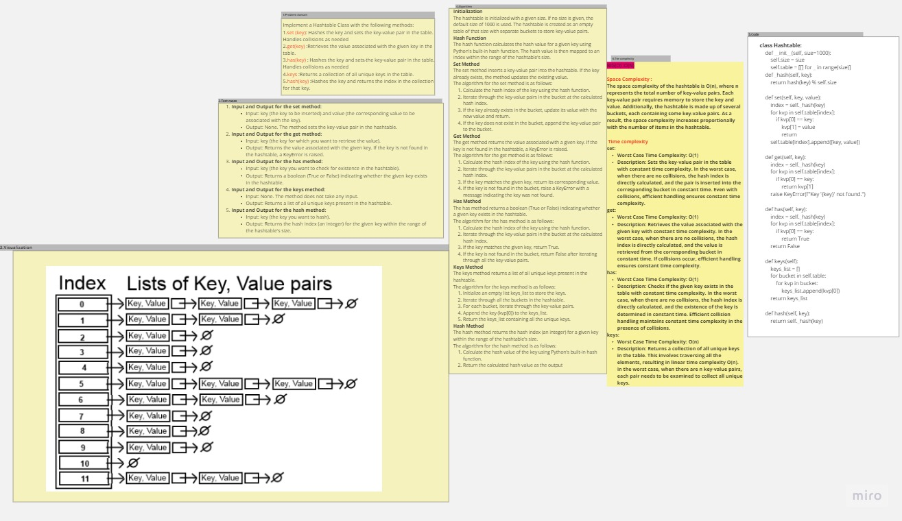

# Hash Tables
Implement a Hashtable Class with the following methods:

| Method       | Description                                    |
| ------------ | ---------------------------------------------- |
| `set(key, value)` | Hashes the key and sets the key-value pair in the table. Handles collisions as needed. |
| `get(key)`   | Retrieves the value associated with the given key in the table. |
| `has(key)`   | Checks if the given key exists in the table. Returns a boolean. |
| `keys()`     | Returns a collection of all unique keys in the table. |
| `hash(key)`  | Hashes the key and returns the index in the collection for that key. |

## Whiteboard Process

## Approach & Efficiency
Space Complexity :
The space complexity of the hashtable is O(n), where n represents the total number of key-value pairs. Each key-value pair requires memory to store the key and value. Additionally, the hashtable is made up of several buckets, each containing some key-value pairs. As a result, the space complexity increases proportionally with the number of items in the hashtable.

| Method      | Worst Case Time Complexity | Description                                                |
| ----------- | ------------------------- | ---------------------------------------------------------- |
| set         | O(1)                      | Sets the key-value pair in the table with constant time complexity. In the worst case, when there are no collisions, the hash index is directly calculated, and the pair is inserted into the corresponding bucket in constant time. Even in the presence of collisions, efficient collision handling ensures constant time complexity. |
| get         | O(1)                      | Retrieves the value associated with the given key with constant time complexity. In the worst case, when there are no collisions, the hash index is directly calculated, and the value is retrieved from the corresponding bucket in constant time. If collisions occur, efficient handling ensures constant time complexity. |
| has         | O(1)                      | Checks if the given key exists in the table with constant time complexity. In the worst case, when there are no collisions, the hash index is directly calculated, and the existence of the key is determined in constant time. Efficient collision handling maintains constant time complexity in the presence of collisions. |
| keys        | O(n)                      | Returns a collection of all unique keys in the table. Involves traversing all the elements, resulting in linear time complexity O(n). In the worst case, when there are n key-value pairs, each pair needs to be examined to collect all unique keys. |

## Solution
 pytest 