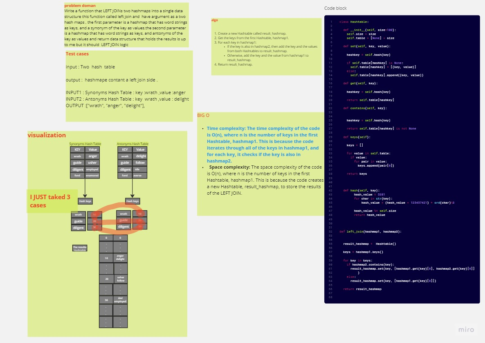

# hashmap-left-join
 Write a function that LEFT JOINs two hashmaps into a single data structure this function called left join and  have argument as a two hash maps , the first parameter is a hashmap that has word strings as keys, and a synonym of the key as values.the second parameter is a hashmap that has word strings as keys, and antonyms of the key as values and return data structure that holds the results is up to me but it should  LEFT JOIN logic
## Whiteboard Process
   

## Approach & Efficiency
 BIG O 

Time complexity: The time complexity of the code is O(n), where n is the number of keys in the first Hashtable, hashmap1. This is because the code iterates through all of the keys in hashmap1, and for each key, it checks if the key is also in hashmap2.
  Space complexity: The space complexity of the code is O(n), where n is the number of keys in the first Hashtable, hashmap1. This is because the code creates a new Hashtable, result_hashmap, to store the results of the LEFT JOIN.

## Solution
 pytest 