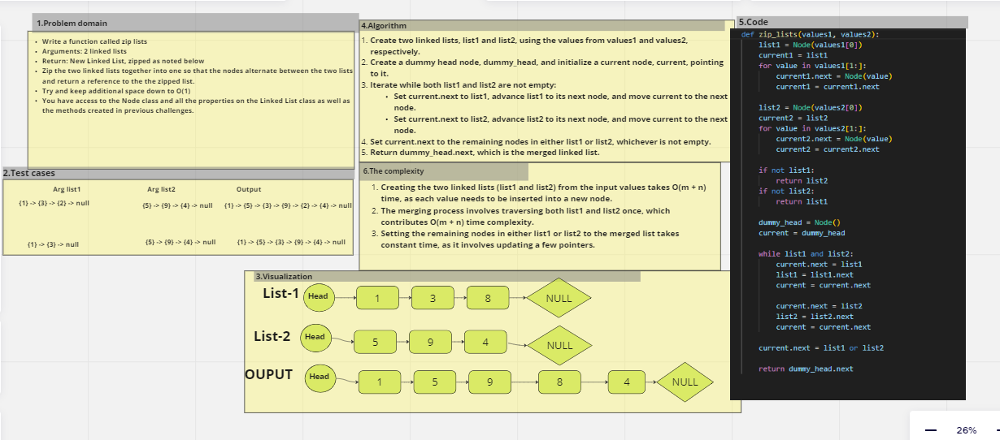

# linked-list-zip
Write a function called zip lists
Arguments: 2 linked lists
Return: New Linked List, zipped as noted below
Zip the two linked lists together into one so that the nodes alternate between the two lists and return a reference to the the zipped list.
Try and keep additional space down to O(1)
You have access to the Node class and all the properties on the Linked List class as well as the methods created in previous challenges.

## Whiteboard Process
  

## Approach & Efficiency
  Creating the two linked lists (list1 and list2) from the input values takes O(m + n) time, as each value needs to be inserted into a new node.
The merging process involves traversing both list1 and list2 once, which contributes O(m + n) time complexity.
Setting the remaining nodes in either list1 or list2 to the merged list takes constant time, as it involves updating a few pointers.
## Solution
 pytest
