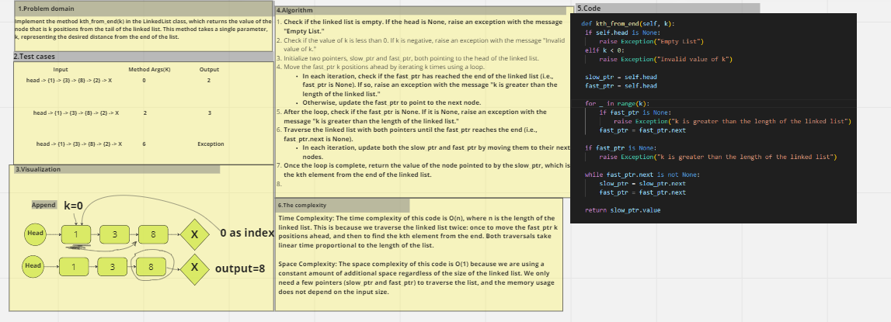

# k-th value from the end of a linked list.

 ## Implement the method kth_from_end(k) in the LinkedList class, which returns the value of the node that is k positions from the tail of the linked list. This method takes a single parameter, k, representing the desired distance from the end of the list.
 
## Whiteboard Process
  

## Approach & Efficiency
 ### Linked list
 ### as over all of the alog :space complexity :O(n) 
 ### but for this funcation is :o(1)

 ### time complexity:O(n) 
## Solution
  ## pytest
  