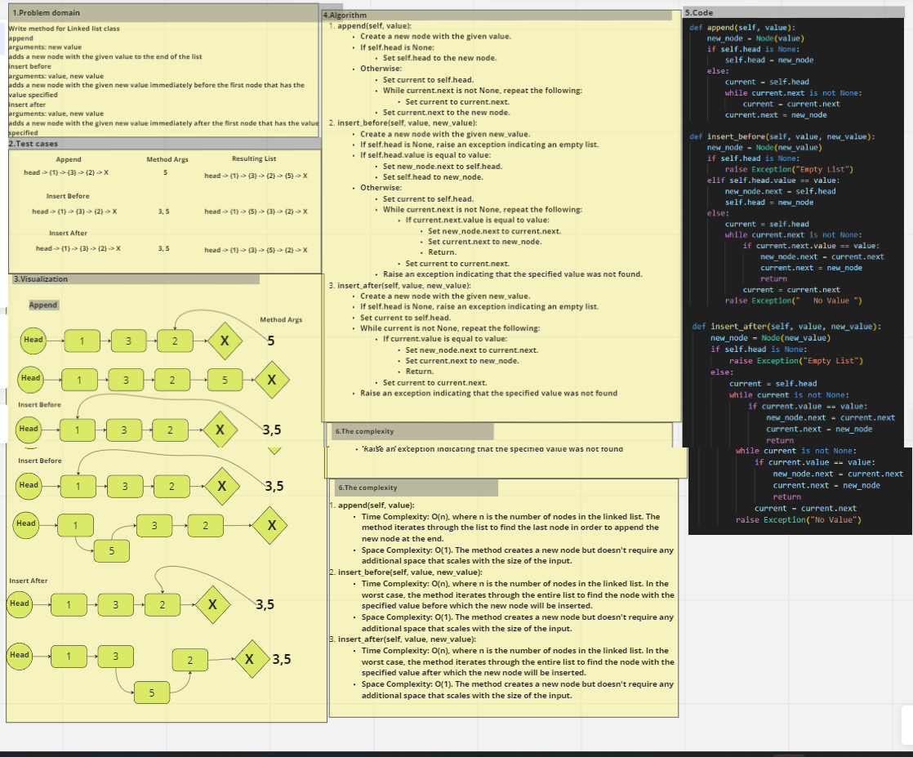

# linked-list-insertions
 
 ## Write  method for Linked list class

# append
## arguments: new value
## adds a new node with the given value to the end of the list
# insert before
## arguments: value, new value
## adds a new node with the given new value immediately before the first node that has the value specified
# insert after
## arguments: value, new value
## adds a new node with the given new value immediately after the first node that has the value specified
# Whiteboard Process

## Approach & Efficiency
### append(self, value):
### Time Complexity: O(n), where n is the number of nodes in the linked list. The method iterates through the list to find the last node in order to append the new node at the end.
### Space Complexity: O(1). The method creates a new node but doesn't require any additional space that scales with the size of the input.
### insert_before(self, value, new_value):
### Time Complexity: O(n), where n is the number of nodes in the linked list. In the worst case, the method iterates through the entire list to find the node with the specified value before which the new node will be inserted.
### Space Complexity: O(1). The method creates a new node but doesn't require any additional space that scales with the size of the input.
### insert_after(self, value, new_value):
### Time Complexity: O(n), where n is the number of nodes in the linked list. In the worst case, the method iterates through the entire list to find the node with the specified value after which the new node will be inserted.
### Space Complexity: O(1). The method creates a new node but doesn't require any additional space that scales with the size of the input.
## Solution
 
 ### python linked-list.py  and for testing pytest