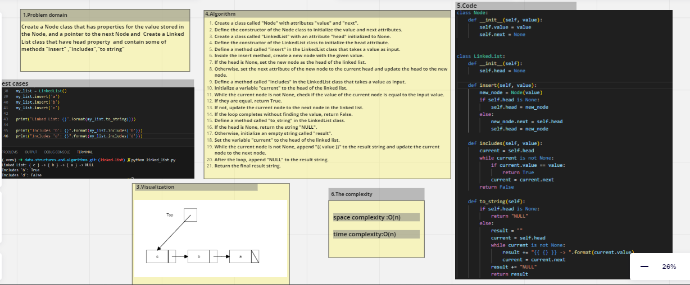

<<<<<<< HEAD
# Linked List Implementation
## Create a Node class that has properties for the value stored in the Node, and a pointer to the next Node and  Create a Linked List class that have head property  and contain some of methods "insert" ,"includes","to string"
=======
# data-structures-and-algorithms

| Code-Challenge| Name |
| ---------------- | ---------------- |
| Code-Challenge 1  | [Array-reverse](array_reveres/README.md)
| Code-Challenge 2  | [Array-insert-shift](array-insert-shift/README.md)
| Code-Challenge 3  | [Array-binary-search](array-binary-search/README.md)

>>>>>>> main

## Whiteboard Process 

## Approach & Efficiency
 ### Linked list
 ### space complexity :O(n) 
 ### time complexity:O(n) 
## Solution
 ### python linked_list.py
 ### pytest