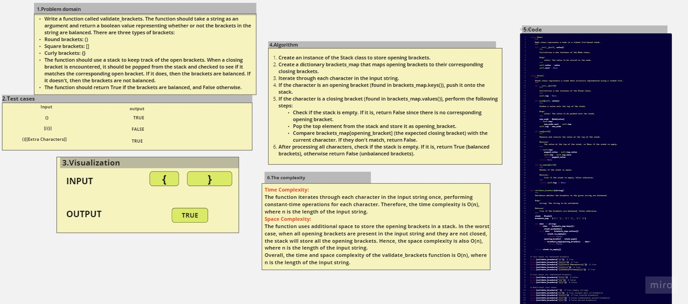

# stack-queue-brackets
 Write a function called validate_brackets. The function should take a string as an argument and return a boolean value representing whether or not the brackets in the string are balanced. There are three types of brackets:
Round brackets: ()
Square brackets: []
Curly brackets: {}
The function should use a stack to keep track of the open brackets. When a closing bracket is encountered, it should be popped from the stack and checked to see if it matches the corresponding open bracket. If it does, then the brackets are balanced. If it doesn't, then the brackets are not balanced.
The function should return True if the brackets are balanced, and False otherwise.

## Whiteboard Process

 
## Approach & Efficiency
Time Complexity: 
The function iterates through each character in the input string once, performing constant-time operations for each character. Therefore, the time complexity is O(n), where n is the length of the input string.
Space Complexity: 
The function uses additional space to store the opening brackets in a stack. In the worst case, when all opening brackets are present in the input string and they are not closed, the stack will store all the opening brackets. Hence, the space complexity is also O(n), where n is the length of the input string.
Overall, the time and space complexity of the validate_brackets function is O(n), where n is the length of the input string.
## Solution
  python sqb.py