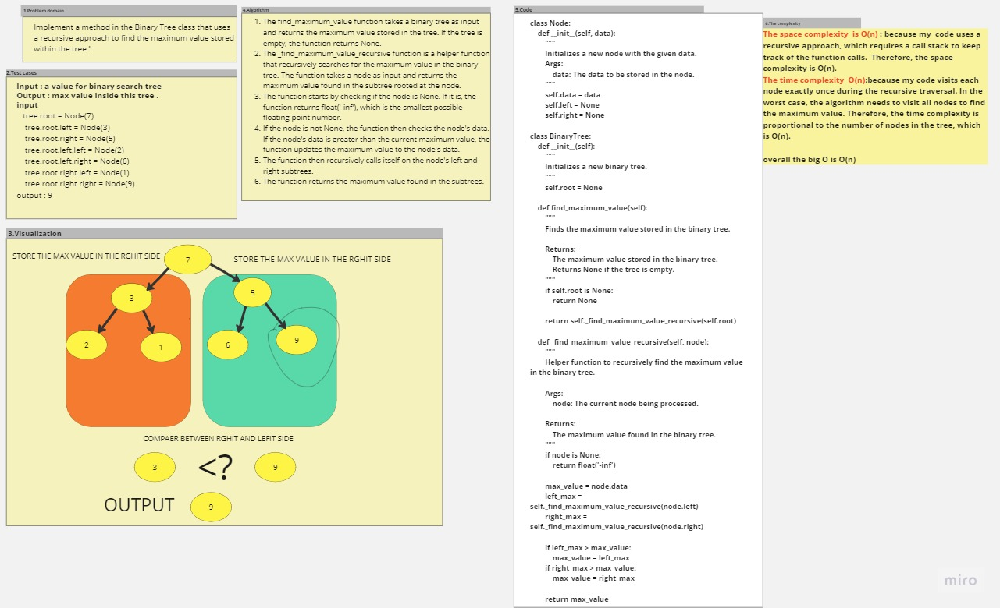

# tree-max
 ## Implement a method in the Binary Tree class that uses a recursive approach to find the maximum value stored within the tree."

## Whiteboard Process

## Approach & Efficiency
## Approach
### The find_maximum_value function takes a binary tree as input and returns the maximum value stored in the tree. If the tree is empty, the function returns None.
### The _find_maximum_value_recursive function is a helper function that recursively searches for the maximum value in the binary tree. The function takes a node as input and returns the maximum value found in the subtree rooted at the node.
### The function starts by checking if the node is None. If it is, the function returns float('-inf'), which is the smallest possible floating-point number.
### If the node is not None, the function then checks the node's data. If the node's data is greater than the current maximum value, the function updates the maximum value to the node's data.
### The function then recursively calls itself on the node's left and right subtrees.
### The function returns the maximum value found in the subtrees.

## Efficiency

### The space complexity  is O(n) : because my  code uses a recursive approach, which requires a call stack to keep track of the function calls.  Therefore, the space complexity is O(n).
### The time complexity  O(n):because my code visits each node exactly once during the recursive traversal. In the worst case, the algorithm needs to visit all nodes to find the maximum value. Therefore, the time complexity is proportional to the number of nodes in the tree, which is O(n).

## overall the big O is O(n)

## Solution
 ### pytest
