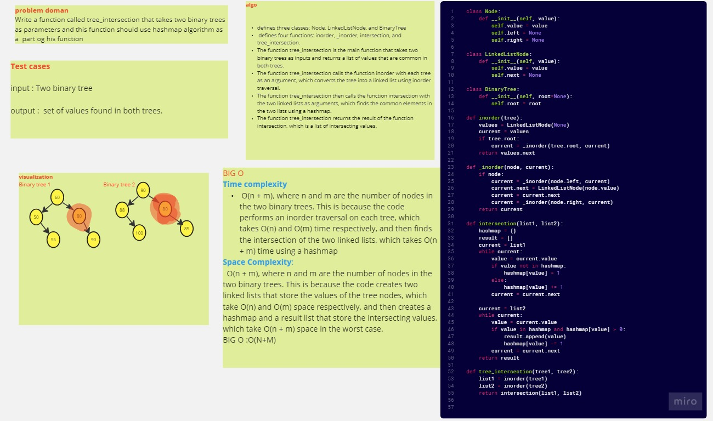

# Tree-intersection
Write a function called tree_intersection that takes two binary trees as parameters and this function should use hashmap algorithm as a  part og his function 
## Whiteboard Process
   

## Approach & Efficiency
Time complexity
 O(n + m), where n and m are the number of nodes in the two binary trees. This is because the code performs an inorder traversal on each tree, which takes O(n) and O(m) time respectively, and then finds the intersection of the two linked lists, which takes O(n + m) time using a hashmap
Space Complexity:
  O(n + m), where n and m are the number of nodes in the two binary trees. This is because the code creates two linked lists that store the values of the tree nodes, which take O(n) and O(m) space respectively, and then creates a hashmap and a result list that store the intersecting values, which take O(n + m) space in the worst case.
BIG O :O(N+M)

## Solution
 pytest 